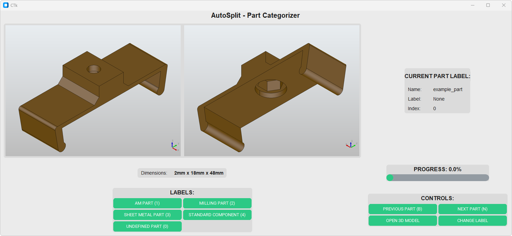

## Labeling App

  

### Preparation Steps
Before copying the dataset to the labeling app, ensure that the necessary files are generated:

1. **Generate `info.json` Files**:
   - Use the `info_json_creation.py` script to process your dataset and create metadata files for each part.
   - The generated `.json` files contain important information about each STEP file.

2. **Generate Screenshots**:
   - Use the `dataset/part_screenshots.py` script to capture images of each part.
   - These screenshots will help visualize the parts during labeling.

---

### How to Use the Labeling App

1. **Copy Dataset Contents**:
   - Place the generated `info` JSON files into the `data/info` subfolder of the app directory.
   - Place the generated `png` screenshots into the `data/png` subfolder of the app directory.

2. **Start the App**:
   - Launch the Labeling App by running the provided `.exe` file.
   - Enter a two-character code (e.g., your initials) to start labeling.
   - If you pause labeling, you can resume seamlessly from where you left off.

3. **Retrieve Final Labels**:
   - Once labeling is complete, the labeled data will be saved in the `csv` folder of the app directory.
   - These files can be used for further processing or cross-validation with other labelers’ files.

---

### Notes
- Ensure all required files are correctly placed in their respective subfolders before launching the app.
- For large datasets, consider batch-generating `info.json` files and screenshots to streamline the setup process.

