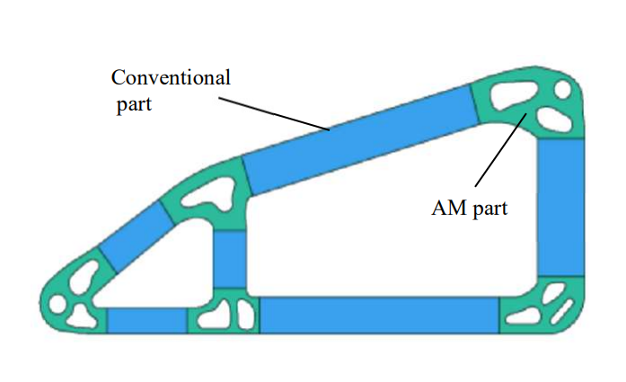
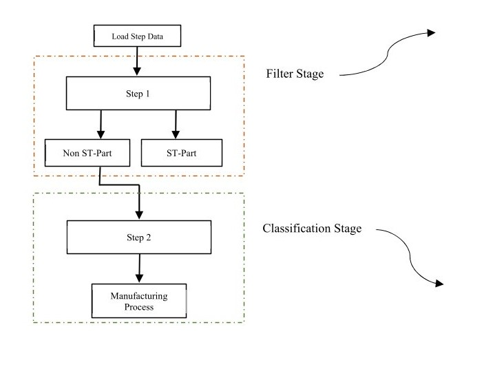
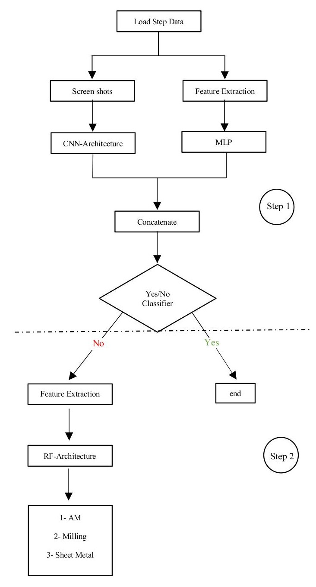
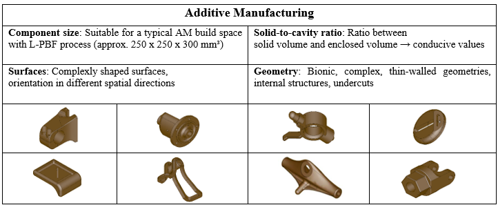
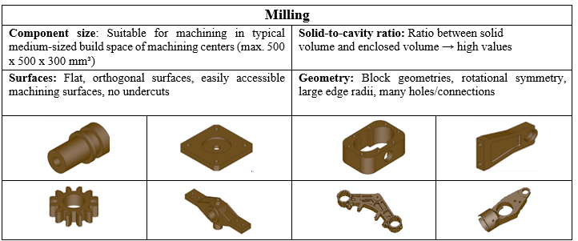
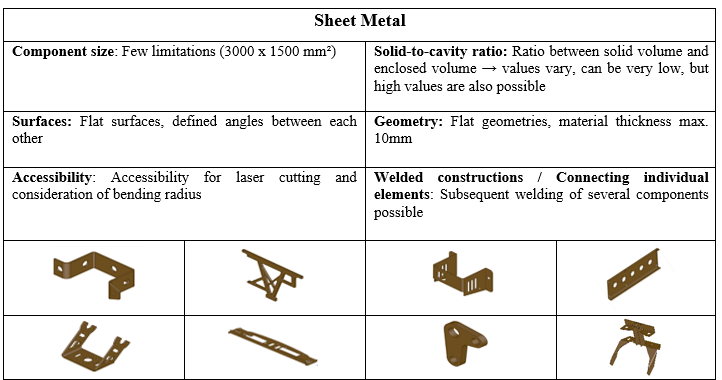
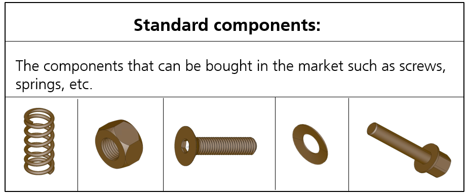

# Name: AutoSplit: Two-Stage AI Architecture for Enhanced Classification of Manufacturing Processes

<div align="center">
  
</div>


## Overview
AutoSplit is an innovative machine learning framework for manufacturing process classification. Using a two-stage architecture, it combines computer vision and ML techniques for accurate process classification.

## Overview
AutoSplit is an innovative machine learning framework for manufacturing process classification. Using a two-stage architecture, it combines computer vision and ML techniques for accurate process classification.
<table style="border-collapse: collapse; border: none;">
<tr style="border: none;">
<td style="border: none;"></td>
<td style="border: none;"></td>
</tr>
</table>

### Features:

Stage 1: Hybrid Neural Network (CNN + MLP)
94.2% accuracy for standard/non-standard parts
ResNet50V2 backbone
Multi-perspective CAD analysis
Visual and geometric feature processing

Stage 2: Random Forest Classifier
82% accuracy in process classification
Categories: AM, milling, sheet metal
50 quantitative features
Probabilistic output

### Technical Highlights:
- Integration with OpenCascade Technology (OCCT) for feature extraction  
https://dev.opencascade.org/doc/refman/html/class_g_prop___g_props.html
- Processing of STEP file formats
- Automated feature extraction pipeline
- Support for both geometric and visual analysis
- Batch processing capabilities for large assemblies
- Real-time classification support

### Applications:
- Automated process planning in Industry 4.0
- Design for Manufacturing (DfM)
- Cost estimation and optimization
- Manufacturing process selection
- Standard part identification
- CAD model classification

### Performance Improvements:
- +22.1% standard part identification
- +19.7% AM component recall
- +16.9% sheet metal component recall
- +9.6% overall accuracy vs single-stage

## Visuals
<div style="display: flex; justify-content: space-between;">
    
    
</div>
<div style="display: flex; justify-content: space-between;">
    
    
</div>

## Dataset
The model was trained on:
- 20,000 CAD STEP models
- Sources: GrabCAD, Fusion360 Gallery, and TraceParts
- Categorized into four classes: AM, milling, sheet metal, and standard parts

## Installation requirements
- Python 3.8+
- PyTorch 1.9+
- OpenCascade Technology (OCCT)
- scikit-learn
- numpy
- pandas
  
## Quick start

- git remote add origin https://github.com/MNazarian/AutoSplit.git
- git remote -v
- git branch -M main

## Usage  
Follow the steps below to get started with the model.

### 1. Install Dependencies
First, ensure you have all the necessary dependencies installed. You can install them using `pip`:

```bash
pip install -r requirements.txt

```
### 2. Load the Model

```bash
from autosplit import AutoSplitModel

```

# Load the pre-trained AutoSplit model
```bash

model = AutoSplitModel.load('path_to_trained_model')

```

### 3. Make Predictions
```bash
# Path to the CAD file (STEP format)
cad_file_path = 'path_to_cad_file.step'

# Predict the manufacturing process
process_prediction = model.predict(cad_file_path)

# Print the predicted manufacturing process
print(f"The predicted manufacturing process is: {process_prediction}")
```

### 4. Example Output

- Additive Manufacturing (AM)
- Milling
- Sheet Metal
- Standard Parts

**Example:** The predicted manufacturing process is: **Milling**


## Support
Tell people where they can go to for help. It can be any combination of an issue tracker, a chat room, an email address, etc.

## Roadmap

| folder     | Contents                 |
|------------|------------------------|
| `data/`    | preprocessing, feature_extraction |
| `models/`  | cnn_mlp, random_forest |
| `utils/`   | Useful scripts     |
| `tests/`   | test cases              |

## Contributing
1. Fork the repository
2. Create a new branch for your feature
3. Make your changes
4. Submit a pull request

## Authors and acknowledgment
- Mehdi Nazarian (Fraunhofer IAPT),
- Rafael Neves (Fraunhofer IAPT)
- Léon Klick (Autoflug GmbH)
- Robert Lau (Fraunhofer IAPT)
- Felix Weigand (Fraunhofer IAPT)


## License
For open source projects, say how it is licensed.


## Citation

```bibtex
@article{nazarian2024autosplit,
    title={AutoSplit: A Novel Two-Stage AI Architecture for Enhanced Classification of Manufacturing Processes},
    author={Nazarian, Mehdi and Neves, Rafael and Klick, Le'on and Lau, Robert and Weigand, Felix},
    journal={arXiv preprint},
    year={2024},
    url={https://gitlab.cc-asp.fraunhofer.de/iapt/prozesskettenautomatisierung/bauteildesign/autosplit},
    note={Under Review}
}
